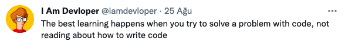

## Instructor Information

**Instructor:** Gül İnan

**E-mail:** inan@itu.edu.tr

**Office:** Room 424 @ Department of Mathematics

**Office hour:** Send me an e-mail for your queries or for scheduling
an online appointment via Zoom.

## Course Information  

**Course Type:** Elective for undergraduate students.

**Course Credits:** 3 local credits (6 ECTS credits).

**Course Prerequisites:** MAT 116/E MIN DD.

**Course Description:** 

Data science is an interdisciplinary and broad field using mathematics, statistics, and computer science methods and tools to extract information and insight from data in different forms. This course is an introductory level data science course on introducing different data types (structured and unstructured) from different fields arising mostly from digital technologies or available on the web, and then focusing on importing, cleaning, reshaping, exploring, and visualizing these data.

**Computer skills:**

We will be using `R` programming language with `RStudio IDE` for data related works. You will prepare your all works (reports and presentations) in `R Markdown`, which closely follows `Markdown` syntax. 
You will also be using the version control system `Git` along with `GitHub` to submit homework assignments and
team-based works. Lastly, prior knowledge of `HTML`, `CSS`, and `JavaScript` brings a big plus to produce fancy outputs for your works. But it is neither a must nor focus of this course.

**Course website:** For each study, you will also receive an invitation soon to submit your study to the `GitHub Classroom` of the following organization:

https://github.com/MAT381E-Fall21.

**Class Schedule:** Mondays between 14:30-17:30 p.m. (Local time in Istanbul).

**Classroom:** Online via secured ITU Zoom platform.

**Course Logistics:**  Each week, before the class, a Zoom meeting invitation will be sent you via your ITU email to join the class on Mondays. Lectures will be automatically recorded and you will have a chance re-watch the videos after the class on https://ninova.itu.edu.tr. Lecture materials (notes, assignments, grades etc) will be uploaded on https://ninova.itu.edu.tr.

**Course Objectives:** This course aims to: 

1.	Provide basic knowledge required for using data science computational tools such as a programming language and its packages associated with data science, a dynamic report application, and version control system.
2.	Introduce different types of data from different disciplines arising from digital technologies or available on the web.
3.  To give an ability for accessing, cleaning, reshaping, exploring, and visualizing different types of data from different disciplines.
4.	To give an ability for interpreting data arising from different disciplines and making data-driven inferences.

**Course Tentative Plan**: We will closely follow the weekly schedule given below.
However, weekly class schedules are subject to change depending on the progress we make as a class.

<link rel="stylesheet" href="https://use.fontawesome.com/releases/v5.6.1/css/all.css">

| **Week** | **Date**   | **Topic**         |  <i class="fab fa-github"></i> | 
| :---:    | :---:      | :------------------|:------:|
| 1 | 04/10 | Introduction to data science and computational tools. **(Project proposal assigned)** |  [🔗](https://github.com/MAT381E-Fall21/Week_01_02_Lecture_Notes) |
| 2 | 11/10 | Tools for data importing, manipulating, and tidying.|  [🔗](https://github.com/MAT381E-Fall21/Week_03_04_Lecture_Notes) |
| 3 | 18/10 | Basic principles of data visualization.| [🔗](https://github.com/MAT381E-Fall21/Week_05_06_Lecture_Notes)|
| 4 | 25/10 | Data visualization tools.| |
| 5 | 01/11 | Handling with strings and dates in data. **(HW1 assigned, Project proposal submission)**| [🔗](https://github.com/MAT381E-Fall21/Week_07_Lecture_Notes)|
| 6 | 08/11 | Scraping data from web.||
| 7 | 15/11 | Data extraction from social networking sites. | |
| 8 | 22/11 | ITU Fall Break. ||
| 9 | 29/11 | Basic principles of text mining.| |
| 10 | 06/12 | Network analysis and visualization.| |
| 11 | 13/12 | Basic principles of geographic information system. **(Project interim report submission)**| |
| 12 | 20/12 | Visualization of spatial and urban data. **(HW2 assigned)**| |
| 13 | 27/12 | Basic principles of interactive data visualization.|  |
| 14 | 03/01 | Interactive web-based data visualization tools.| |
| 15 | 10/01| Relational databases. | |
| 16-17 | 17-30/01| Final exam week. **(Final report submission, Project website on GitHub pages, Oral presentation)** | |

**Additional <i class="fab fa-github"></i> Repositories**

 - [Git/GitHub/RStudio usage](https://github.com/MAT381E-Fall21/git_github_rstudio_usage_guide).

**Student Learning Outcomes:** A student who completed this course successfully is expected to: 

1.	Know the recent technologies associated with data science,
2.  Know basic programming skills with R Programming and get familiar with its data science related packages,
3.	Know how to access data from various sources,
4.  Know how to clean, reshape, explore, and visualize the data for reporting and further analysis.
5.	Know how to make data-driven inferences,
6.	Know how to perform reproducible research,
7.  Know how to present findings both verbally and orally,
8.  Know how to do collaborative work and effectively work in a team environment, and
9.  Know how to communicate with audience from different disciplines

immediately following the course, and/or a few months after the course.

**Textbook:**  All lecture materials. 

**Course Workload:** 2 homework assignments, a team-based project (see the details below).  

**Recommended Bibliography:** Students are encouraged to consult the following
sources on their own:

1. Wickham, H. and Grolemund, G. (2016). R for data science: import, tidy, transform, visualize, and model data. O'Reilly Media, Inc. [Freely available through the book’s website https://r4ds.had.co.nz/].

2.	Bivand, R.S., Pebesma, E.J., Gomez-Rubio, V., and Pebesma, E. J. (2013). sp. New York: Springer. 2nd ed. [Electronic resource at ITU Library Services].

3.	Carson, S. (2020). Interactive web-based data visualization with R, plotly, and shiny. CRC Press. [Freely available through the book’s website https://plotly-r.com/].

4.	Douglas, A.L. (2015). A user’s guide to network analysis in R. Cham: Springer International Publishing. 1st ed. [Electronic resource at ITU Library Services].
  
5.  Silge, J., and Robinson, D. (2017). Text mining with R: A tidy approach. O'Reilly Media, Inc. [Freely available through the book’s website https://www.tidytextmining.com/]. 
    
6.  Wickham, H. (2016). ggplot2: Elegant graphics for data analysis. Springer, 2nd ed. [Electronic resource at ITU Library Services].

**Off-Campus Access to the ITU Library E-sources:**  

Access to library e-sources remotely
is possible with a library account. Users without a library account should apply for the library registration at https://kutuphane.itu.edu.tr/en/register. After setting the web configurations given at https://kutuphane.itu.edu.tr/en/services /web-browser-proxy-settings only once on your computer, you will able to have an access to ITU Library e-sources.

**Selected Important Dates:**
For the official ITU Fall 2021 academic calendar, please visit:

https://www.sis.itu.edu.tr/TR/ogrenci/akademik-takvim/akademik-takvimler/takvim2022/lisans-akademik-takvimi.php

Here are some selected important dates in Fall 2021 semester:

October 4, 2021: First day of classes.

October 4-8, 2021: Add-drop week.

October 29, 2021: Republic Day of Turkey (Friday, No classes).

November 22-26, 2021: ITU Fall Break (No classes).

January 1, 2022: New year (Saturday).

January 14, 2022: Last day of classes.

January 17-30, 2022: Final exam week.

I also honor other national and religous holidays. Students, who needs flexibility on individual-based studies overlapping with these special days, can inform me.

## Course Policies

Please read the information below as a reference for how this class will be conducted. 

**Grading Policy:**

- Assessment Method      Total Contribution to Final Grade:
  - 2 homework assignments each 10%,
  - 1 team-based project   80%.
  - Detailed break-down of the team-based project:
    - Project proposal                                     10%,
    - Project interim written-report                       20%,
    - Project final written-report                         20%,
    - Project website on GitHub pages                      5%,
    - Project final oral presentation                      20%,
    - Peer evaluation                                      5%,
    - Statement of personal contribution.

- Exact submission dates for each study above will be announced at well in advance.

- Homework assignments are individual-based studies, whereas team-based project is the product of team. 

- All members of a team will get the same point on **the project proposal, interim report, final report, report posted on GitHub pages, and oral presentation**. However, I reserve the right to assign different grades to each team member based on peer evaluations (see below).
  
- Each team member should contribute to oral presentation where the allocated time is evenly distributed among the team members. If any member of
the team fails to do oral presentation, that individual will receive “0” for oral presentation grade.

- The peer evaluation point of a student will be the average of the points which his/her team members will assign to him/her.

- If any member for a specific team fails to submit the peer evaluation form, all members of that team will receive “0” for peer evaluation grade.

- **For detailed information on project design guideline and related documents, please see the relevant document on Ninova.** 

- **Every study mentioned above should be submitted by each student via GitHub Classroom of MAT381E-Fall21 organization.**

**Late Submission Policy:** Students are expected to do homework assignments by themselves. Neither homework assignments nor team-based works will be accepted after deadline. There are **NO** make-ups for missed homework and team-based works. The students who have Covid-19 medical report during the submission periods can ask for extension only.

**Final Exam Attendance Policy:** None.

**Make-Up Exam Policy:** Not applicable this semester.

**Class Attendance Policy:** 

The students must attend at least 70% of classes and
are deemed responsible to manage his/her absences.

**Participation Policy:** 

The students are expected to ask and answer
questions, participate in in-class activities, and
show their interest and engagement in the class. 

**E-mail Policy:**

Please:

1. Use a proper descriptive subject line (which may consist of the course number MAT381E followed
by a short phrase summarizing the subject of your e-mail).
2. Start off your e-mail with a proper greeting, introduce yourself (give your name), then state your problem as short as possible.
3. Finally, use a proper closing and then finish your e-mail with your first name and so on.

Feel free to send me e-mails. But be sure you that give me enough time to get back to you. In the past, I have had pretty much tolerance for e-mail messages sent after business hours and at weekends. But, now, due to pandemic, I should say that I may not appreciate these e-mails anymore.
Lastly, e-mails asking for grade grubbing at the end of the semester are not welcomed.

   
**Equity, Diversity, and Inclusion:** 

In this class, I am committed to cultural and individual differences and diversity as including, but not limited to, age, disability, ethnicity, gender, gender identity, language, national origin, race, religion, culture, and socioeconomic status and I acknowledge the value of differences. 

  
**Academic Honesty Policy:** 

At every stage of the academic life, every ITU student is responsible for obeying the academic honesty policy of ITU stated below:

https://odek.itu.edu.tr/en/code-of-honor/ethics-in-university-life.

**Student with Special Needs:** 

If you are a student with special needs, let me know
that how we can adjust the course environment and materials in accordance with your needs. 
Furthermore, you are also invited to contact the office of students with special needs at:

http://engelsiz.itu.edu.tr/.

**ITU Distance Education Policy:** 

Sharing the lecture recordings or its piece with third parties is strictly forbidden. Furthermore, the recordings are subject to investigation by the authorities as needed. For that reason, be sure that you behave (both orally and verbally) responsibly in this virtual class. Please visit:

https://online.itu.edu.tr/,

for more information on distance education regulations at ITU.

